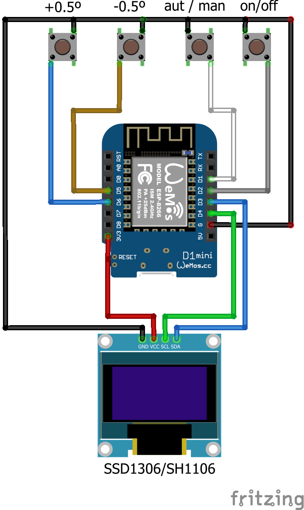

Remote control for Supla Thermostat based on DirectLink
 

 
With Oled display and buttons for Automatic/Manual, Manual On/Off, thermostat setting -0.5º and + 0.5º

operation with both the thermostat with or without OLED

without OLED:
https://forum.supla.org/viewtopic.php?f=10&t=5294

with OLED
https://forum.supla.org/viewtopic.php?f=10&t=5320

the display shows the status of the thermostat the same as the Oled version.
the screen automatically dims after 15 seconds and the first press on one of the buttons makes it bright again.
if any button is pressed while the screen is dimmed, it will glow and the following presses will acruate according to the button pressed. 
After 15 seconds without pressing any button the screen dims. 

In wificonfig you will have to setup the suplaserver and DirectLink data: 
D_Link_1 --- paste the DirectLink corresponding to the Auto/Man channel.  
D_Link_2 --- paste the DirectLink corresponding to the Manual On/Off channel.  
D_Link_3 --- paste the DirectLink corresponding to the thermostat setting channel. 
Link Temp -- paste the DirectLink corresponding to the temperature channel. 
Link Ther -- paste the DirectLink corresponding to the thermostat channel. 

Gpio: 
Gpio 0 ; //D3-SDA   
Gpio 2 ; //D4-SCL 
Gpio 5 ; //D1     // triger Link 1  and wifi config  
Gpio 4 ; //D2     // triger Link 2 
Gpio 14; //D5     // triger Link 3 
Gpio 12; //D6     // triger Link 4 

